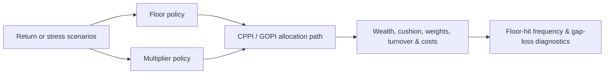
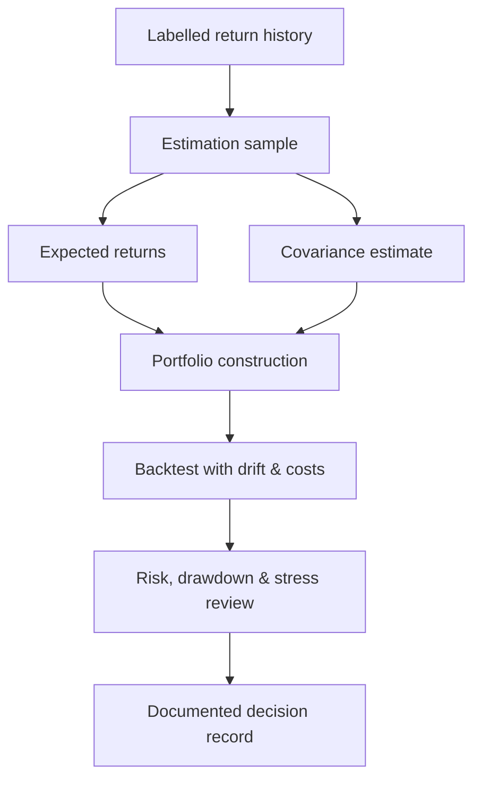

<div align="center">

# AssetManagementToolkit

### Research-grade Python primitives for modern asset management

**Measure risk · construct portfolios · simulate uncertainty · protect capital**


<br>

`AssetManagementToolkit` turns reusable quantitative-investment research into
small, labelled, testable Python APIs. It covers the path from return
measurement and covariance estimation through portfolio construction,
simulation, CPPI/GOPI protection, backtesting, diagnostics, and presentation.

[Quick start](#quick-start) ·
[Capabilities](#capability-map) ·
[Portfolio insurance](#portfolio-insurance-cppi--gopi) ·
[Tutorials](#learning-path) ·
[API documentation](#api-documentation)

</div>

---

## Design principles

| Principle | What it means in this toolkit |
|---|---|
| **Labelled by default** | Pandas indexes and asset names are preserved and validated. |
| **Explicit assumptions** | Frequency, annualization, floors, constraints, costs, timing, and look-ahead boundaries are visible inputs. |
| **Research before execution** | APIs calculate, simulate, diagnose, and propose; they do not connect to brokers or place orders. |
| **Reproducible scenarios** | Simulation uses explicit random seeds and returns auditable scenario matrices. |
| **Clean provenance** | Historical material is treated as evidence; production code is independently implemented or migrated only with verified permission. |
| **Synthetic education** | Tutorials require no credentials, private data, or network access. |

> [!IMPORTANT]
> This is a quantitative research toolkit—not investment advice, a guarantee
> engine, or an automated trading system.

## Capability map

| Area | Included capabilities | Module |
|---|---|---|
| **Return & risk analytics** | Compounding, annualized return, volatility, semivariance, drawdown, VaR/CVaR, Sharpe, Sortino, Calmar, information ratio, beta, alpha | `analytics` |
| **Drawdown & style** | Drawdown paths and episodes, static and rolling returns-based style analysis | `analytics` |
| **Factor analysis** | Static/rolling OLS, regularized factor models, attribution, trailing returns | `analytics` |
| **Covariance estimation** | Sample, constant-correlation, and shrinkage covariance estimators | `estimation` |
| **Portfolio construction** | Markowitz, GMV, maximum Sharpe, efficient frontier, Black–Litterman, risk contributions, ERC and target risk budgets | `portfolio` |
| **Weighting policies** | Equal weight, capped equal weight, capitalization weight | `portfolio` |
| **Portfolio insurance** | Fixed-maturity CPPI, open-ended CPPI, TIPP, volatility-controlled CPPI, GOPI, empirical jump gap-risk diagnostics | `allocation` |
| **Backtesting** | Start-of-period target weights, drift, turnover, proportional costs, NAV | `backtesting` |
| **Stress testing** | Historical windows, hypothetical shocks, asset contributions, multi-period paths | `stress` |
| **Simulation** | GBM, compensated Merton jumps, Variance Gamma, Nolan `S0` alpha-stable paths | `simulation` |
| **Calibration** | GBM/Merton likelihood, VG cumulant matching, diagnostics, walk-forward validation | `simulation` |
| **Time series** | Chronological splits, rolling origin, seasonal naïve, ETS/Holt–Winters, SARIMA, decomposition, forecast metrics | `time_series` |
| **Regime diagnostics** | Observed episodes, transition counts/probabilities, conditional return statistics | `market_regime_classification` |
| **Graphical analysis** | Sparse dependency networks, clusters, embeddings, Plotly figures, optional Dash app | `graphical_analysis`, `visualization`, `dashboard` |

## Installation

Clone or open the repository, then install the package in editable mode:

```bash
python -m pip install -e .
```

Install optional capabilities only when needed:

```bash
# Jupyter, plotting, Dash, and tutorial dependencies
python -m pip install -e ".[tutorials]"

# Classical time-series models
python -m pip install -e ".[forecasting]"

# Regularized factor models
python -m pip install -e ".[factor-model]"

# Sparse graphical analysis
python -m pip install -e ".[graphical]"
```

## Quick start

### 1. Review return and risk

```python
import pandas as pd

from asset_management_toolkit.analytics import risk_return_stats

returns = pd.Series(
    [0.018, -0.024, 0.011, 0.007, -0.006, 0.021],
    index=pd.date_range("2026-01-31", periods=6, freq="ME"),
    name="strategy",
)

report = risk_return_stats(
    returns,
    risk_free_rate=0.02,
    periods_per_year=12,
)

print(report)
```

### 2. Construct a long-only portfolio

```python
import pandas as pd

from asset_management_toolkit.portfolio import (
    global_minimum_variance,
    maximum_sharpe_ratio,
    risk_contributions,
)

expected_returns = pd.Series(
    {"bond": 0.045, "balanced": 0.075, "equity": 0.105}
)
covariance = pd.DataFrame(
    [
        [0.010, 0.003, 0.002],
        [0.003, 0.028, 0.009],
        [0.002, 0.009, 0.055],
    ],
    index=expected_returns.index,
    columns=expected_returns.index,
)

gmv = global_minimum_variance(covariance)
maximum_sharpe = maximum_sharpe_ratio(
    0.02,
    expected_returns,
    covariance,
)
contributions = risk_contributions(maximum_sharpe, covariance)
```

### 3. Simulate jumps and inspect terminal wealth

```python
from asset_management_toolkit.simulation import (
    simulate_merton_jump_returns,
    terminal_wealth_stats,
)

jump_scenarios = simulate_merton_jump_returns(
    n_years=5,
    n_scenarios=2_000,
    expected_return=0.07,
    volatility=0.15,
    jump_intensity=1.5,
    jump_mean=-0.12,
    jump_volatility=0.20,
    periods_per_year=12,
    seed=42,
)

terminal = terminal_wealth_stats(
    jump_scenarios,
    initial_wealth=100.0,
    floor_wealth=80.0,
)
```

## Portfolio insurance: CPPI & GOPI

The allocation package separates three concerns:



### Fixed-maturity CPPI and gap risk

```python
from asset_management_toolkit.allocation import (
    analyze_cppi_gap_risk,
    run_fixed_maturity_cppi,
)

cppi = run_fixed_maturity_cppi(
    jump_scenarios,
    multiplier=3.0,
    guarantee_fraction=0.80,
    initial_wealth=100.0,
    risk_free_rate=0.03,
    periods_per_year=12,
)

gap_risk = analyze_cppi_gap_risk(
    cppi,
    confidence_level=0.95,
)

print(cppi.summary())
print(gap_risk.statistics)
```

`analyze_cppi_gap_risk` reports the empirical floor-hit fraction, expected
terminal shortfall, conditional loss, loss quantile, maximum floor shortfall,
and worst terminal loss across the supplied scenarios.

### Growth-Optimal Portfolio Insurance

GOPI extends the reserve from constant-rate cash to a locally risky asset whose
return path also drives the protection floor.

```python
import pandas as pd

from asset_management_toolkit.allocation import run_growth_optimal_cppi

monthly_reserve_return = 1.03 ** (1 / 12) - 1
reserve_returns = pd.Series(
    monthly_reserve_return,
    index=jump_scenarios.index,
    name="reserve_bond",
)

gopi = run_growth_optimal_cppi(
    jump_scenarios,
    reserve_returns,
    expected_risky_return=0.08,
    expected_reserve_return=0.03,
    risky_volatility=0.18,
    reserve_volatility=0.06,
    correlation=0.25,
    floor_fraction=0.80,
    initial_wealth=100.0,
    maximum_multiplier=4.0,
)
```

For risky asset `S` and reserve asset `R`, the unconstrained growth-optimal
multiplier is

```text
relative variance = σ²S + σ²R − 2ρσSσR
m* = (gS − gR + 0.5 × relative variance) / relative variance
```

The volatility-controlled CPPI policy also accepts
`volatility_exponent=2/alpha` for the alpha-stable jump-hazard scaling discussed
by Cont and Tankov. Only returns strictly before the allocation period enter
the toolkit's realized-volatility estimator.

> [!WARNING]
> A CPPI floor is an allocation objective, not an unconditional guarantee.
> Price jumps, discrete rebalancing, leverage, costs, and liquidity can move
> wealth below the floor.

## Portfolio construction workflow



The toolkit deliberately keeps estimation, allocation, evaluation, and
presentation separate. This makes it harder to accidentally mix future
observations into a historical decision.

## Learning path

All notebooks use synthetic data and run without credentials.

| Level | Notebook | Focus |
|---:|---|---|
| 01 | [`01_risk_and_return_foundations.ipynb`](tutorials/01_risk_and_return_foundations.ipynb) | Core return and risk statistics |
| 02 | [`02_portfolio_construction.ipynb`](tutorials/02_portfolio_construction.ipynb) | Markowitz construction |
| 03 | [`03_asset_management_workflow.ipynb`](tutorials/03_asset_management_workflow.ipynb) | Estimation/evaluation separation |
| 04 | [`04_simulation_foundation.ipynb`](tutorials/04_simulation_foundation.ipynb) | GBM and terminal wealth |
| 05 | [`05_heavy_tail_and_jump_simulation.ipynb`](tutorials/05_heavy_tail_and_jump_simulation.ipynb) | Merton, VG, and alpha-stable tails |
| 06 | [`06_calibration_and_model_selection.ipynb`](tutorials/06_calibration_and_model_selection.ipynb) | Calibration and walk-forward review |
| 07 | [`07_stress_testing_foundation.ipynb`](tutorials/07_stress_testing_foundation.ipynb) | Historical and hypothetical stress |
| 08 | [`08_black_litterman_portfolio.ipynb`](tutorials/08_black_litterman_portfolio.ipynb) | Black–Litterman views |
| 09 | [`09_graphical_analysis.ipynb`](tutorials/09_graphical_analysis.ipynb) | Dependency networks and dashboard |
| 10 | [`10_returns_based_style_analysis.ipynb`](tutorials/10_returns_based_style_analysis.ipynb) | Static and rolling style analysis |
| 11 | [`11_cppi_family_strategies.ipynb`](tutorials/11_cppi_family_strategies.ipynb) | CPPI, GOPI, and jump gap risk |
| 12 | [`12_time_series_forecasting.ipynb`](tutorials/12_time_series_forecasting.ipynb) | Leakage-aware classical forecasting |
| 13 | [`13_covariance_estimation.ipynb`](tutorials/13_covariance_estimation.ipynb) | Covariance estimation |
| 14 | [`14_risk_budgeting_and_erc.ipynb`](tutorials/14_risk_budgeting_and_erc.ipynb) | Risk budgets and ERC |
| 15 | [`15_factor_regression.ipynb`](tutorials/15_factor_regression.ipynb) | Labelled factor regression |

## Project structure

```text
Asset_Management_Tool_Git/
├── src/asset_management_toolkit/
│   ├── analytics/                  # return, risk, style, drawdown, factors
│   ├── estimation/                 # covariance estimators
│   ├── portfolio/                  # Markowitz, BL, weighting, risk budgets
│   ├── allocation/                 # CPPI, GOPI, and gap-risk diagnostics
│   ├── simulation/                 # GBM, jumps, VG, stable, calibration
│   ├── stress/                     # probability-free stress testing
│   ├── backtesting/                # weights, drift, costs, and NAV
│   ├── time_series/                # forecasting and evaluation
│   ├── market_regime_classification/
│   ├── graphical_analysis/
│   ├── visualization/
│   └── dashboard/
├── tests/                          # deterministic unit and integration tests
├── tutorials/                      # executable synthetic notebooks
├── examples/                       # small runnable workflows
├── docs/                           # provenance, inventory, and roadmap
└── docs-site/                      # searchable API reference
```

## Research contracts

- Periodic returns are decimal simple returns: `0.01` means 1%.
- Returns below `-1.0`, infinite values, duplicate labels, and unsupported
  alignment are rejected.
- Annual rates and `periods_per_year` are explicit.
- Benchmark analytics use pairwise date alignment.
- Portfolio construction validates labels, dimensions, covariance structure,
  feasibility, and optimizer success.
- Backtests apply target weights at the documented start-of-period boundary.
- Simulation seeds control reproducibility—not forecast confidence.
- Stable distributions use Nolan's `S0` parameterization; moments may not
  exist when `alpha < 2`.
- GOPI moment paths are point-in-time research assumptions. The function does
  not estimate them from future returns.
- Gap-risk frequencies describe supplied scenarios. They are not calibrated
  probabilities unless the scenario design supports that interpretation.
- Calculation functions do not mutate caller-owned inputs.

## API documentation

The searchable reference documents signatures, formulas, parameters, return
types, examples, and interpretation limits:

**[Open the private AssetManagementToolkit API reference →](https://asset-management-toolkit-docs.nutdnuy.chatgpt.site)**

The documentation site is versioned and deployed separately from this
repository.

## Development

Run the verification suite from the repository root:

```bash
pytest
ruff check src tests examples scripts
ruff format --check src tests examples scripts
```

Rebuild the scoped CPPI tutorial:

```bash
python scripts/build_cppi_tutorial.py
```

CI targets Python 3.9–3.13 and executes the tutorial suite on Python 3.11.

## Provenance and project boundary

`resource_เก่า/` is a read-only discovery archive and is excluded from Git.
Historical files are capability evidence—not automatically production code.

Every accepted component should have:

1. a clear public or owner-authorized basis;
2. an explicit numerical and timing contract;
3. deterministic tests;
4. a synthetic example or tutorial; and
5. a provenance record under [`docs/provenance/`](docs/provenance/).

The CPPI/GOPI extension is independently implemented from the reviewed
portfolio-insurance literature. See
[`docs/provenance/cppi-family.md`](docs/provenance/cppi-family.md) and
[`docs/research/gopi-and-jump-gap-risk-review.md`](docs/research/gopi-and-jump-gap-risk-review.md).

Remaining advanced work—including correlated multivariate scenarios and
CIR/rates/bond simulation—is tracked in
[`docs/roadmap/deferred-simulation-modules.md`](docs/roadmap/deferred-simulation-modules.md).

---

<div align="center">

### Build → Test → Explain → Govern

Designed for research that should remain understandable after the notebook is
closed.

</div>
